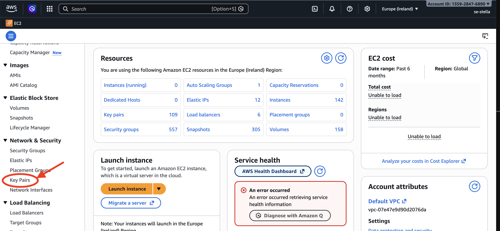
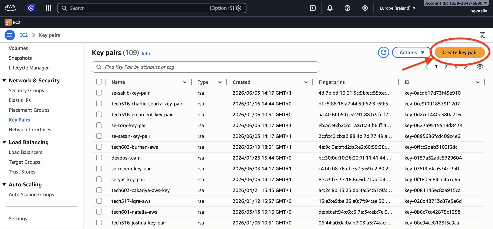
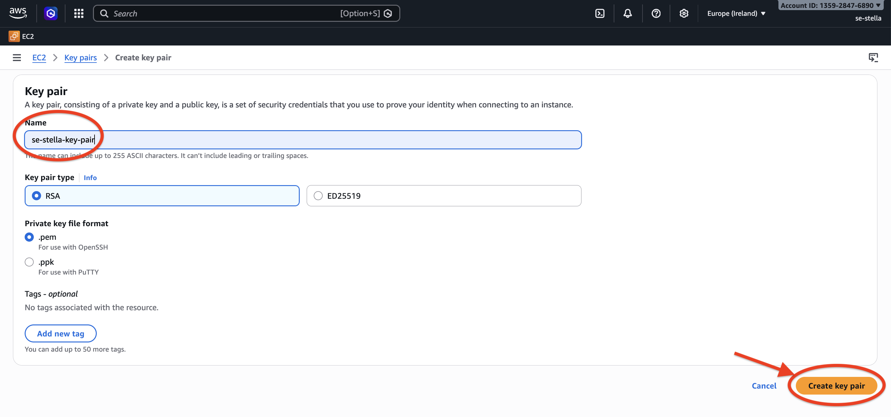
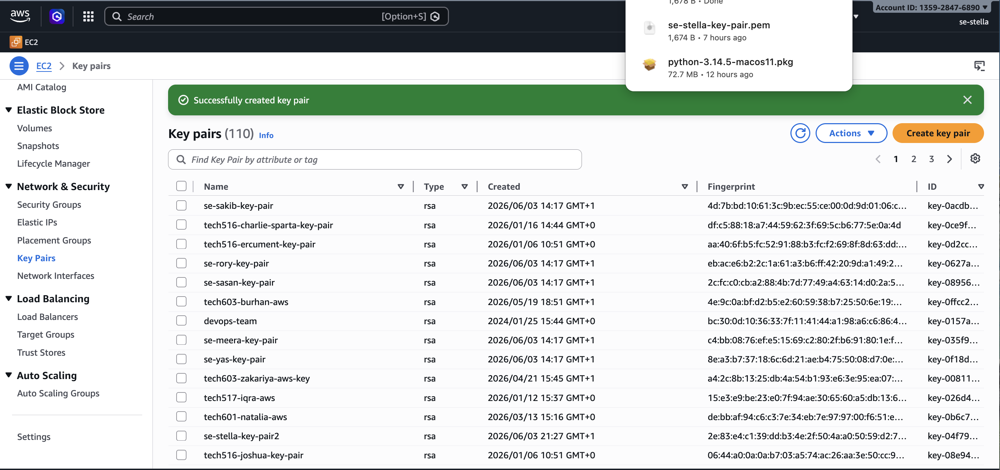
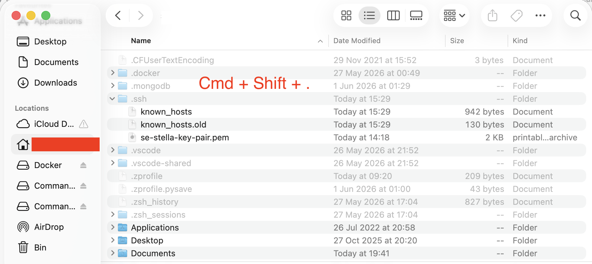
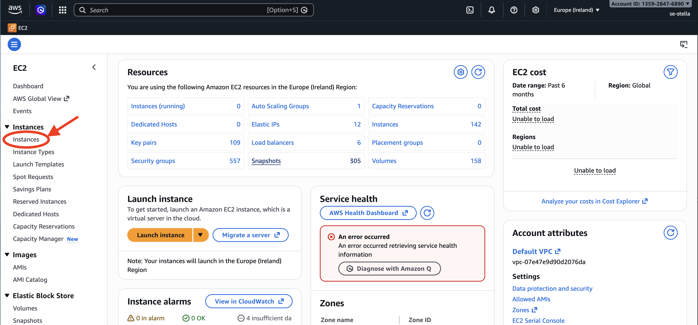
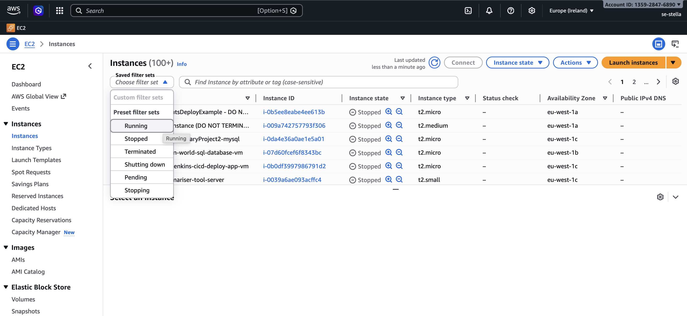
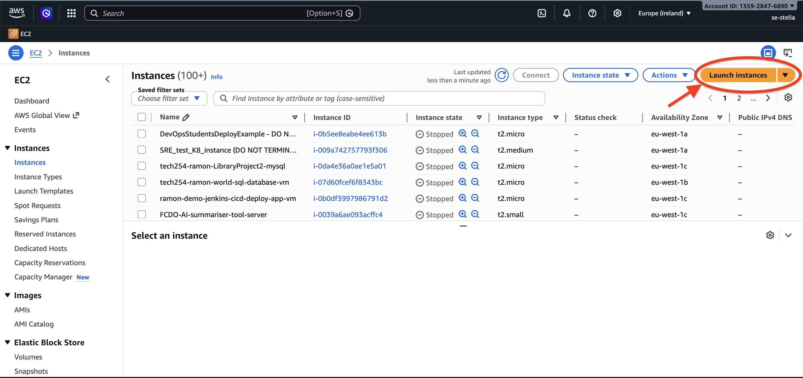

# AWS EC2 Instance Setup

## Objective

Create and connect to an EC2 instance on AWS.

## Step 1: Select AWS Region and Open Console

Go to the AWS global infrastructure page to understand available regions and availability zones: [AWS Regions](https://aws.amazon.com/about-aws/global-infrastructure/regions_az/)

Then log in to the AWS Management Console. You will be taken to the Console Home. 

Before creating an instance, change the region required for your setup at the top of the page (see screenshot below). This ensures you are working within the correct AWS data centre location.

## Step 2: Create a Key Pair

Before launching the instance, create a key pair. The key pair is used to authenticate and securely connect to the EC2 instance using SSH.

A key pair consists of a public key and a private key. The public key is used by AWS to “lock” access to the instance, while the private key is kept on your machine and is used to “unlock” and gain access.

**Analogy:** Think of it like a padlock and key. The public key is like a padlock that you place on the EC2 instance. The private key is like the physical key you keep. Only the correct key can open the padlock and allow access.

### Step 1: Open EC2

Use the AWS search bar and type **EC2**. Open the EC2 service. You can also star it for later access.

### Step 2: Go to Key Pairs

In the EC2 dashboard, scroll down to “Network & Security” and select **Key Pairs**.

### Step 3: Create Key Pair

Select **Create key pair**.

### Step 4: Configure Key Pair

> **Note:** You can generate a key pair locally using tools like `ssh-keygen`.
>
> When you create a key pair in AWS:
>
> AWS generates both keys (public and private).
>
> AWS gives you only the private key, which is automatically downloaded as a `.pem` file.
>
> AWS keeps the public key and installs it on the instance.

Enter a name for your key pair and leave the other settings as default (RSA encryption and .pem file format). No tags are used.

> **Note:** It is good practice to use standard naming conventions. A common format is `team-name-what-it-is`, for example: `se-stella-key-pair`.

Select **Create key pair** button.

After selecting **Create key pair**, a success message appears at the top confirming that the key pair was successfully created. The private key (.pem file) is automatically downloaded to your machine.

## Step 3: Store the Private Key Securely

After creating the key pair, the `.pem` file (private key) is downloaded to your machine. It should be stored securely and not shared.

It is good practice to keep the file in a hidden folder on your machine (for example `.ssh`) to reduce the risk of accidental exposure.

## Step 3: Store the Private Key Securely

After downloading the `.pem` file, go to your user folder on your machine. To view hidden files on Mac, use the shortcut **Cmd + Shift + .**. Hidden folders and files will appear greyed out.

If you do not see a `.ssh` folder, create one using **Cmd + Shift + N**, then rename it to `.ssh` (make sure to include the dot so it stays hidden).

Next, go to your **Downloads** folder, cut the `.pem` file, and paste it into the `.ssh` folder.

## Step 4: Create an EC2 Instance

> **Note:** A virtual machine in the cloud is called an instance.

EC2 stands for Elastic Compute Cloud. It allows you to create virtual machines of different sizes and scale by running multiple instances, so you can choose the right size VM for efficiency.

EC2 is an example of IaaS (Infrastructure as a Service).

1. In the left sidebar, select **Instances**.

> **Note:** It is useful to apply filters such as **Running** in Saved filter sets to show only running instances instead of the full list.

2. Select **Launch Instance**

Select **Launch instance** to start creating a new EC2 instance.

3. Configure the Launch Instance Page

On the **Launch an instance** page, configure the required settings in each section, such as **Name and tags**, **Application and OS Images (Amazon Machine Image)**, **Instance type**, **Key pair (login)**, **Network settings**, **Configure storage**, and **Advanced details**. See the example settings below:

- **Name and tags**
  - Name: `se-stella-first-instance`

- **Application and OS Images (Amazon Machine Image)**
  - Select the **Ubuntu** tile.
  - From the **Amazon Machine Image (AMI)** dropdown menu, change the image if required. For example, change **Ubuntu 26.04 LTS (HVM), SSD Volume Type** to **Ubuntu Server 24.04 LTS (HVM), SSD Volume Type**.
  - A pop-up message appears: *"Some of your current settings will be changed or removed if you proceed."*
  - Click **Confirm changes**.
  - Remember your username: **ubuntu**. You will use this username later when connecting to the instance from the terminal.

- **Instance type**
  - Select **t3.micro** if you do not need a large instance.
  - `t` indicates a general purpose instance, `3` is the generation, and `micro` is a small size with 2 vCPUs and 1 GB of memory.
  - You can click **Compare instance types** to view other options.

- **Key pair (login)**
  - Start typing the name of your key pair and select it from the dropdown list, for example `se-stella-key-pair`.
  - This assigns the public key to the instance.

- **Network settings**

  

