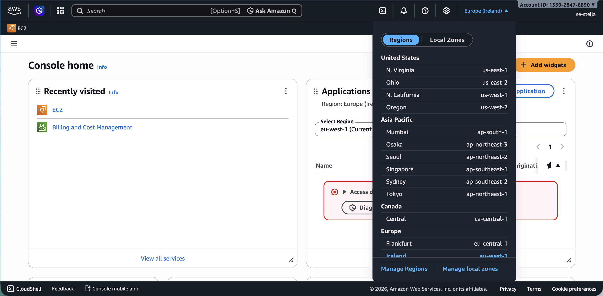
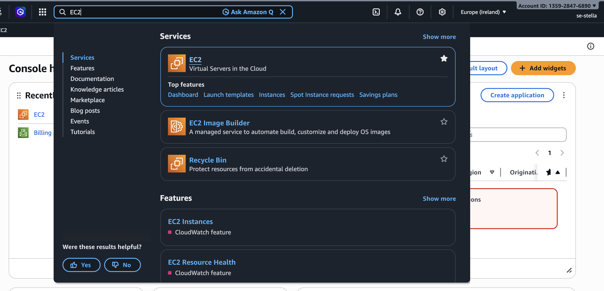

# AWS EC2 Instance Setup

## Objective

Create and connect to an EC2 instance on AWS.

## Step 1: Select AWS Region and Open Console

Go to the AWS global infrastructure page to understand available regions and availability zones: [AWS Regions](https://aws.amazon.com/about-aws/global-infrastructure/regions_az/)

Then log in to the AWS Management Console. You will be taken to the Console Home. 

Before creating an instance, change the region required for your setup at the top of the page (see screenshot below). This ensures you are working within the correct AWS data centre location.

## Step 2: Create a Key Pair

Before launching the instance, create a key pair. The key pair is used to authenticate and securely connect to the EC2 instance using SSH.

A key pair consists of a public key and a private key. The public key is used by AWS to “lock” access to the instance, while the private key is kept on your machine and is used to “unlock” and gain access.

**Analogy:** Think of it like a padlock and key. The public key is like a padlock that you place on the EC2 instance. The private key is like the physical key you keep. Only the correct key can open the padlock and allow access.

### Step 1: Open EC2

Use the AWS search bar and type **EC2**. Open the EC2 service. You can also star it for later access.

### Step 2: Go to Key Pairs

In the EC2 dashboard, scroll down to “Network & Security” and select **Key Pairs**.

### Step 3: Create Key Pair

Select **Create key pair**.

### Step 4: Configure Key Pair

> **Note:** You can generate a key pair locally using tools like `ssh-keygen`.
>
> When you create a key pair in AWS:
>
> AWS generates both keys (public and private).
>
> AWS gives you only the private key, which is automatically downloaded as a `.pem` file.
>
> AWS keeps the public key and installs it on the instance.

Enter a name for your key pair and leave the other settings as default (RSA encryption and .pem file format). No tags are used.

> **Note:** It is good practice to use standard naming conventions. A common format is `team-name-what-it-is`, for example: `se-stella-key-pair`.

