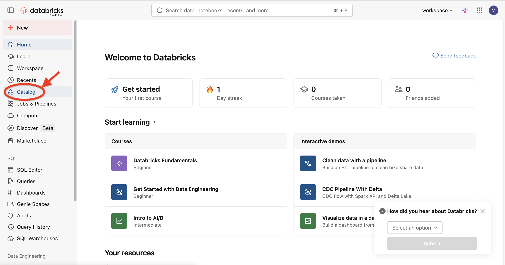
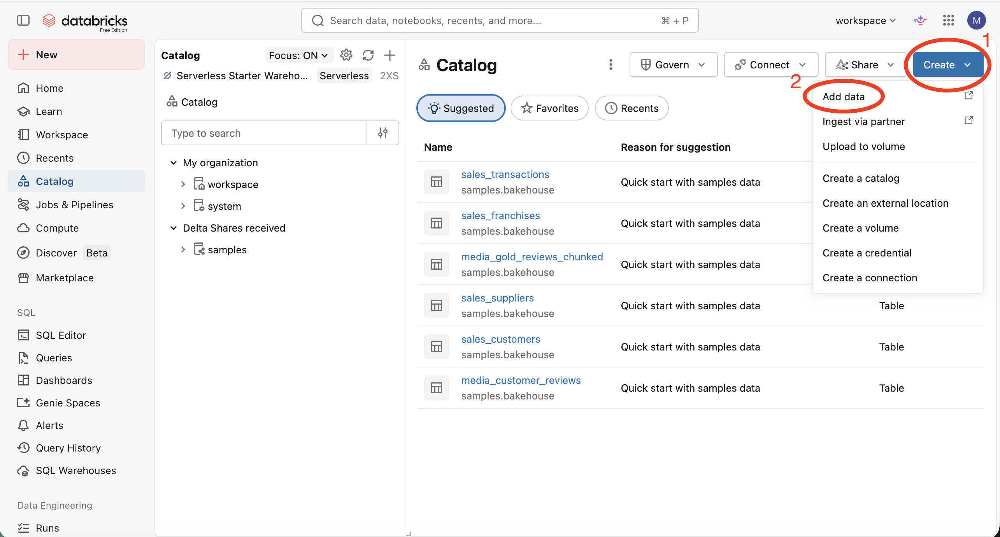
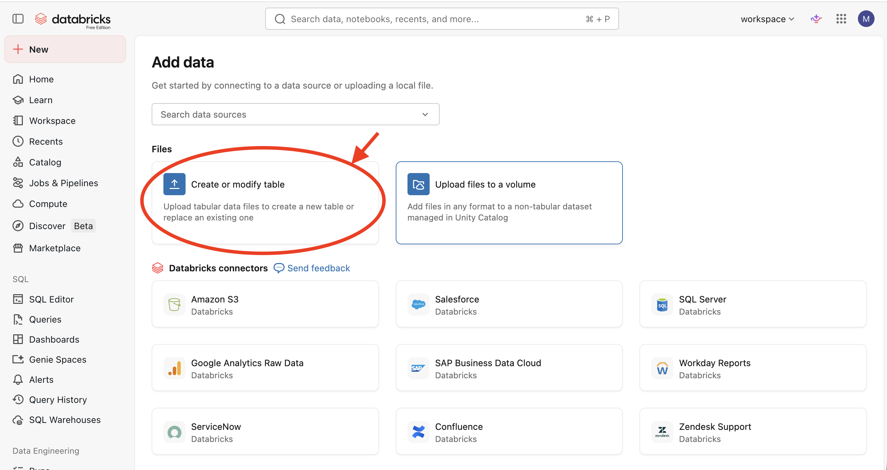
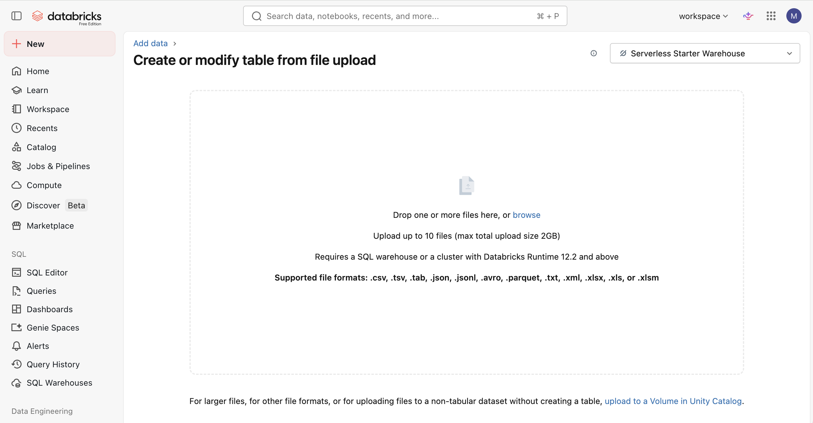
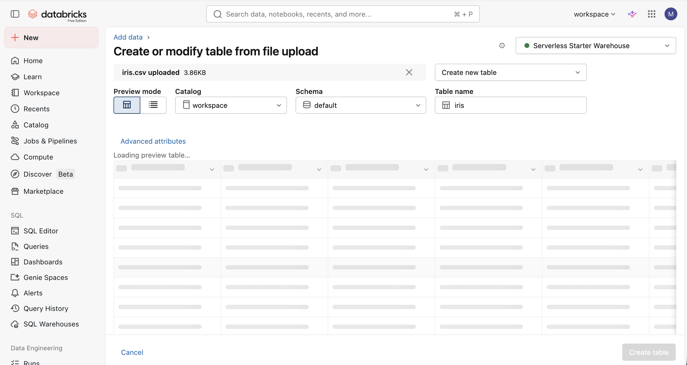
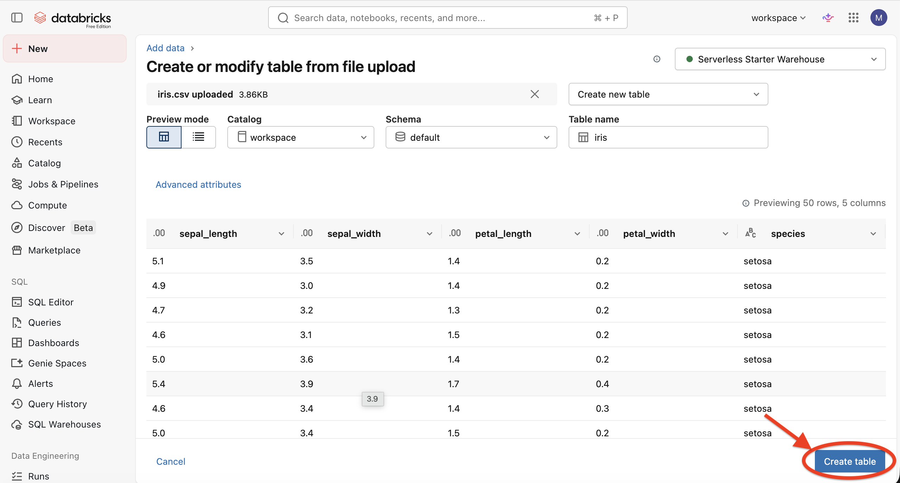
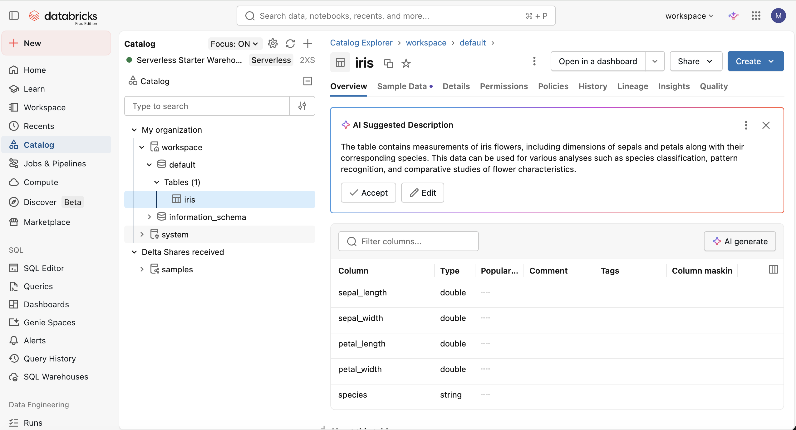
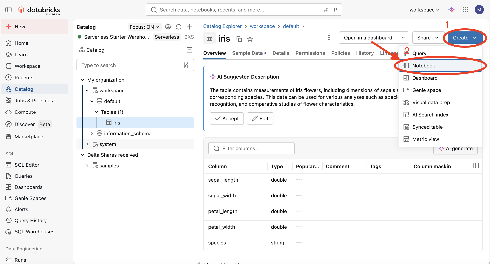
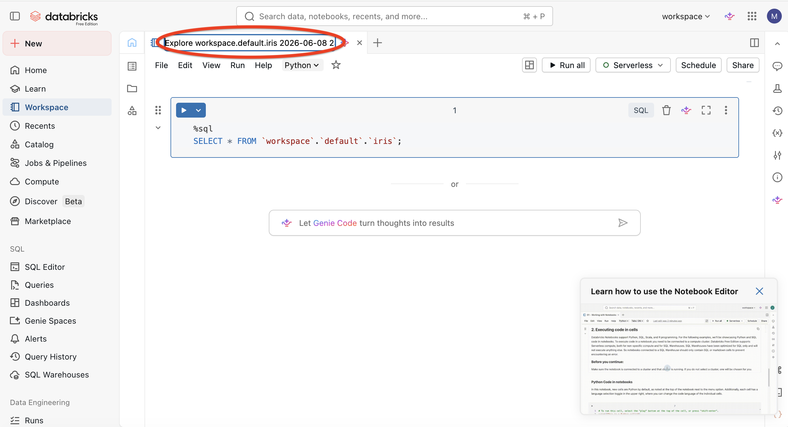

# Databricks and PySpark research

## Question 1: What can be considered "Big Data"?

Big Data is data that is too large, complex, or fast-moving to be efficiently processed using traditional data processing tools.

It is often described by the 3 Vs:

• Volume: very large amounts of data  
• Velocity: data generated and processed quickly  
• Variety: different types of data such as text, images, video, and sensor data

Examples include social media data, online shopping transactions, IoT sensor data, streaming services data, financial market data, and healthcare records.

---

## Question 2: What is OLTP?

OLTP (Online Transaction Processing) is a system designed to handle a large number of short, fast, and real-time database transactions.

It is used for day-to-day operations where data is constantly inserted, updated, or deleted.

**Key characteristics:**
- Fast processing of transactions
- High number of small operations
- Focus on current data (not historical analysis)
- Supports many users at the same time

**Examples:**
- Bank transactions (withdrawals, deposits)
- Online shopping orders
- Booking systems (flights, hotels)
- Payment processing systems

---

## Question 3: What is ACID?

ACID is a set of properties that ensure reliable processing of database transactions.

It stands for:

- Atomicity: A transaction is fully completed or not done at all  
- Consistency: A transaction takes the database from one valid state to another  
- Isolation: Transactions do not interfere with each other  
- Durability: Once a transaction is committed, it is permanently saved

---

## Question 4: What is OLAP?

OLAP (Online Analytical Processing) is a system designed for analysing large amounts of historical data.

It is used for complex queries, reporting, and data analysis rather than day-to-day transactions.

**Key characteristics:**
- Focus on data analysis and insights  
- Works with large historical datasets  
- Fast reading and querying of data  
- Used for decision making rather than operations  

**Examples:**
- Sales trend analysis  
- Financial reporting  
- Business intelligence dashboards  
- Market analysis

---
  
## Question 5: What are Data Warehouses? How do they work?

A data warehouse is a central system used to store large amounts of structured data from multiple sources for analysis and reporting.

It is designed for querying and analysis rather than day-to-day operations (A data warehouse is not used for running live business actions, but for analysing past data and creating reports.)

A giant organised storage system in the cloud where companies keep cleaned data so they can analyse it easily.

**Examples of data warehouse services:**
- Amazon Redshift (AWS)  
- Google BigQuery (Google Cloud)  
- Snowflake (runs on AWS / Azure / GCP)  
- Azure Synapse (Microsoft)

**How it works:**
Data is collected from different systems (such as databases, applications, and files), then:
- Extracted from source systems (copied from the original systems)
- Transformed into a consistent format (cleaned and standardised the data)
- Loaded into the data warehouse (ETL process)

**Once stored, the data is used for:**
- Reporting  
- Dashboards  
- Business analysis  
- Decision making  

📌 **Key idea:**
A data warehouse brings data together in one place so it can be analysed efficiently.

📌 **Simple explanation:**
Data warehouses store data as files across multiple servers, but the data inside those files is organised and presented to users as tables.

---

## Question 6: What are Data Lakes? How do they work?

A data lake is a storage system that holds large amounts of raw data in its original format.

It can store structured data (tables), semi-structured data (JSON, XML), and unstructured data (images, videos, logs).

**How it works:**
Data is collected from different sources and stored directly into the data lake without being heavily processed first.

Later, when needed, the data is processed and analysed for specific use cases.

📌 **Key idea:**
Unlike a data warehouse, a data lake stores raw data first and structures it later when needed.

---

## Question 7: What are Data Lakehouses?

A data lakehouse is a modern data architecture that combines the features of a data lake and a data warehouse.

It allows organisations to store all types of data (like a data lake) while also supporting structured data and fast analytics (like a data warehouse).

**How it works:**
- Data is stored in low-cost storage like a data lake  
- On top of this storage, a structured layer is added  
- This allows SQL queries, analytics, and machine learning on the same data  

📌 **Key idea:**
A lakehouse brings together the flexibility of a data lake and the structure and performance of a data warehouse in one system.

---

## Question 8: What are Delta Lakes?

Delta Lake is an open-source storage layer that adds reliability and structure to a data lake.

It works on top of data lake storage (such as cloud storage) and improves how data is stored and managed.

**Key features:**
- Ensures data reliability using ACID transactions  
- Supports fast queries on large datasets  
- Allows both batch and streaming data processing  
- Keeps data consistent even when multiple users access it  

📌 **Key idea:**
Delta Lake turns a basic data lake into a more reliable and structured system, often used in lakehouse architectures.

---

## Question 9: What is Apache Spark?
 
Apache Spark is a fast, open-source data processing framework used for big data analytics.

It allows distributed processing, meaning it can handle large datasets by splitting work across multiple computers.

**Key features:**
- Very fast processing (in-memory computing)  
- Works with large-scale data  
- Supports multiple languages (Python, Scala, Java, SQL)  
- Can process batch data and streaming data  

📌 **Key idea:**
Apache Spark is used to process and analyse big data efficiently by distributing tasks across many machines.

---

## Question 10: What problem did Apache Spark solve?

Apache Spark was created to solve the problem of slow and inefficient processing of large-scale data.

**Before Spark, big data systems were:**
- slow because they read and wrote data to disk repeatedly  
- complex to program and manage  
- not efficient for real-time or iterative processing  

**What Spark improved:**
- Faster processing using in-memory computing (reducing disk usage)  
- Easier programming with simple APIs  
- Better performance for large-scale and distributed data  
- Support for both batch and streaming data in one system  

📌 **Key idea:**
Apache Spark solves the problem of slow big data processing by making it faster, simpler, and more efficient at scale.

---

## Question 11: How does Apache Spark work? What is the architecture behind the scenes?

### Answer  
Apache Spark uses a distributed architecture to process large amounts of data across multiple machines.

**How it works:**
1. A user submits a Spark application (code)
2. The driver program coordinates the execution
3. The work is split into smaller tasks
4. These tasks are sent to worker machines (nodes)
5. Each worker processes its part of the data in parallel
6. Results are combined and returned to the user

**Main components:**
- Driver: controls the whole process and schedules tasks  
- Cluster Manager: allocates resources across machines  
- Workers (nodes): perform the actual data processing  

📌 **Key idea:**
Spark speeds up big data processing by splitting work across multiple machines and running tasks in parallel.

---

## Question 12: Why did Apache Spark become popular?

Apache Spark became popular because it is much faster and easier to use than older big data tools like Hadoop MapReduce.

**Key reasons:**
- Very fast processing using in-memory computing  
- Easy to use APIs (Python, SQL, Java, Scala)  
- Supports multiple workloads (batch, streaming, machine learning) in one system  
- Scales easily to handle very large datasets  

- Works well with modern cloud platforms (cloud agnostic), such as:
  - AWS (Amazon Web Services)  
  - Azure (Microsoft)  
  - Google Cloud Platform  

📌 **Key idea:**
Spark became popular because it made big data processing faster, simpler, and more flexible.

---

## Question 13: What is PySpark? Why do we tend to use it?

PySpark is a Python interface (API) for Apache Spark that allows you to use Apache Spark functionality with Python code.

It enables you to work with large-scale data processing in a distributed system using familiar Python syntax.

Why we use it:
- Uses Python, which is easy to learn and widely used  
- Allows working with big data without writing Scala or Java  
- Provides access to Spark’s distributed computing power  
- Supports data processing, analytics, and machine learning  

📌 **Key idea:**
PySpark makes Apache Spark accessible to Python developers while still enabling fast, large-scale data processing.

---

## Question 14: What is Databricks?

Databricks is a cloud-based platform that makes it easier to work with big data and machine learning using Apache Spark.

It provides a managed environment where you can write, run, and scale data processing workflows without setting up infrastructure yourself.

Key features:
- Built on Apache Spark  
- Runs in the cloud (AWS, Azure, Google Cloud)  
- Provides notebooks for coding and collaboration  
- Supports data engineering, analytics, and machine learning  
- Automatically manages clusters and resources  

📌 **Key idea:**
Databricks simplifies working with big data by providing a ready-to-use platform built around Apache Spark.

---

## Question 15: What problems did Databricks solve?

Databricks solved several challenges of using Apache Spark and big data systems.

Problems it solved:
- Setting up and managing Spark clusters was complex and time-consuming  
- Infrastructure needed to be configured manually (servers, scaling, updates)  
- Collaboration between data engineers, scientists, and analysts was difficult  
- Performance tuning and resource management required expertise  
- Integrating different data tools was complicated  

How Databricks helps:
- Provides a fully managed Spark environment  
- Automatically handles scaling and infrastructure  
- Offers collaborative notebooks for teams  
- Simplifies data engineering, analytics, and machine learning workflows  

📌 **Key idea:**
Databricks makes big data processing easier by removing the need to manage Spark infrastructure manually.

---

## Question 16: How does Databricks work?

Databricks works as a managed cloud platform built on Apache Spark that runs data processing workloads on scalable clusters.

How it works:
1. A user writes code in notebooks (Python, SQL, Scala, or R)  
2. Databricks creates or uses a Spark cluster in the cloud  
3. The code is sent to Apache Spark running on that cluster  
4. Spark processes the data in a distributed way across multiple machines  
5. Results are returned to the notebook for analysis or visualisation  

Key components:
- Notebooks: interactive workspace for writing code  
- Clusters: groups of virtual machines that run Spark  
- Storage: data is usually stored in cloud storage (like S3 or Azure Data Lake)  
- Spark engine: performs the actual distributed processing  

📌 **Key idea:**
Databricks provides an easy interface on top of Apache Spark and automatically manages the underlying infrastructure.

---

## Question 17: Why has Databricks become popular?
 
Databricks became popular because it makes working with big data and Apache Spark much easier.

Key reasons:
- Eliminates the complexity of setting up and managing Spark clusters  
- Automatically scales resources based on workload  
- Provides collaborative notebooks for teams  
- Integrates data engineering, analytics, and machine learning in one platform  
- Supports major cloud providers (AWS, Azure, and Google Cloud)  
- Built and maintained by the original creators of Apache Spark  
- Helps organisations process large amounts of data more efficiently  

📌 **Key idea:**
Databricks became popular because it simplifies big data processing while providing the power and scalability of Apache Spark.

---

## Question 18: What are Databricks' key features?

- Built on Apache Spark for large-scale distributed data processing
- Cloud-based platform that runs on AWS, Azure, and Google Cloud
- Interactive notebooks for coding, collaboration, and visualisation
- Automated cluster creation, scaling, and management
- Supports multiple languages, including Python, SQL, Scala, and R
- Integrates data engineering, analytics, and machine learning in one platform
- Supports Delta Lake and Lakehouse architectures
- Provides security, governance, and data management tools

📌 **Key idea:**
Databricks provides an easy-to-use, managed platform for working with big data, analytics, and machine learning at scale.

---

## Databricks Account Setup

Please sign up using this link:  
🌐 https://login.databricks.com/

### Steps:
- Click "Create Account"  
- Select "For personal use" / "Get Free Edition"  
- Set username and location  
- "Tell us about yourself" → Skip  
- Wait a few seconds until you reach the Databricks home screen  
- Bookmark or favourite the page for easy access later

---

## Ingesting Data into Databricks

### Step 1: Access sample data (iris.csv)

📌 Dataset location:
https://raw.githubusercontent.com/stellamaj/data-research-lab/main/data-sets/iris.csv

### Step 2: Log in to Databricks

🌐 Open the login page:
https://login.databricks.com/

### Step 3: On the Welcome page, click 👉 **Catalog** in the left sidebar

### Step 4: Select the **Create** dropdown and choose **Add data**

### Step 5: On the Add data page, select the **Create or modify table** tile

### Step 6: On the "Create or modify table from file upload" page, upload the iris.csv file

### 📌 Note: After loading, the data is available as a SQL table preview

### Step 7: After loading, the data is available as a SQL table preview. Click **Create table**

### 📌 Note: The iris dataset has been created as a SQL table named "iris" and can now be queried in Databricks.

## Creating a Notebook in Databricks

## Step 1: Click the **Create** dropdown and select **Notebook**

## Step 2: Rename the notebook at the top to `pyspark_intro_with_iris`

## Additional Notes

✅ Data Warehouse  
- mainly structured data (tables: rows + columns)  
- data is cleaned and organised before storage  
- used for analysis and reporting  

✅ Data Lake  
- stores all types of data  
  - structured (tables)  
  - semi-structured (JSON, logs)  
  - unstructured (images, videos, text)  
- data is kept in raw form first  
- structured later when needed  

✅ Simple summary  
Warehouse = clean, structured data  
Lake = all raw data types stored as they are

---

### In-Memory Computing (Apache Spark)

📌 In-memory computing means data is processed directly in RAM (memory) instead of being constantly read from disk (hard drive). It is faster because data is kept in RAM during computation.

❌ Limitations:
- RAM is limited → not all data can always fit in memory  
- higher cost compared to disk storage  

✅ Why it still works:
Spark does NOT require all data to fit in RAM at once. It:
- splits data across many machines (distributed system)  
- keeps only active data in memory  
- writes overflow to disk when needed  
